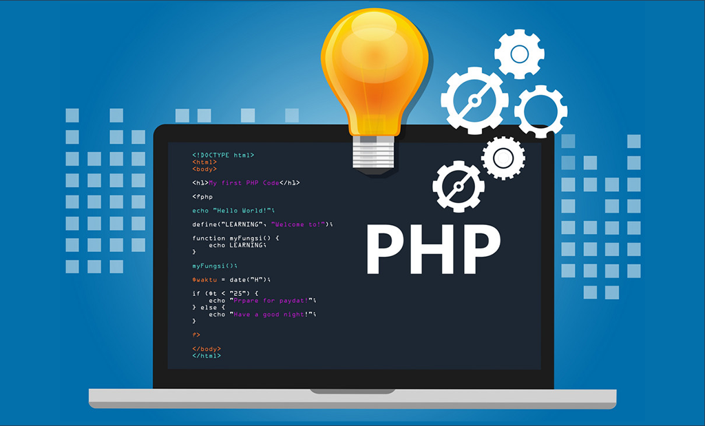

# Curso de PHP y mySQL 53796 

> Curso de PHP y mySQL |  
> Lunes, Martes y Miércoles 10hs a 13hs |      
> Código 53796 |    
> sensei: Marcos Pinardi |    

## Requisitos

 1. Editor
> Sublime Text  
> Visual Studio Code  
> PhpStorm 

 2. Entorno de servidor para desarrollo 
> Xampp https://www.apachefriends.org/es/index.html    

## Definición

> PHP es un lenguaje de progración para al web, específicamente diseñado para generar HTML a pedido.  
> Se ejecuta del lado del server.

## Carpeta de archivos:
>    C:\\Xampp\htdocs\cursophp

## En el navegador:
>    localhost/cursophp

## Recursos

> Manual Oficial de PHP https://www.php.net  
> Stack Overflow https://stackoverflow.com/questions/tagged/php  

